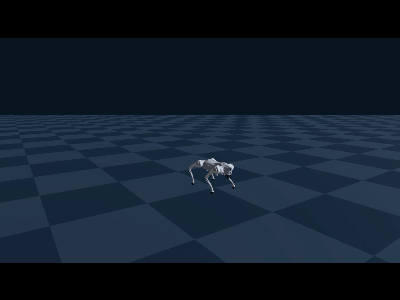
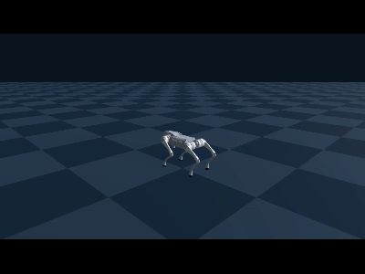
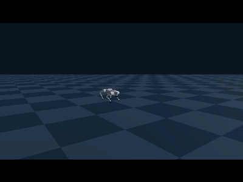
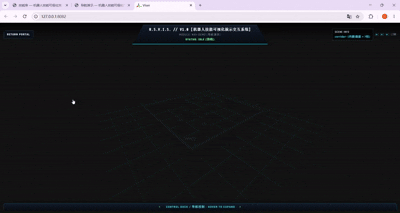
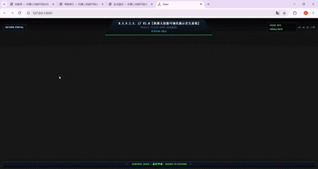

# Robot Skill Visualization and Interactive Demonstration System

This project is a simulation-based demonstration and interaction system designed for the **Unitree Go2 quadruped robot**. It is built with Genesis, PyTorch, Viser, Legged Gym, and RSL-RL.

The system loads pretrained reinforcement learning policies to perform highly dynamic skills, autonomous navigation, and basic locomotion control in the Genesis physics simulation environment. It also provides 3D visualization of the robot’s posture, motion state, sensor data, and path-planning results.

<p align="center">
  
</p>

The system combines reinforcement learning control, physics simulation, path planning, and 3D visualization. Users can switch between different functions through a unified interactive interface, observe skill execution, and monitor the robot’s motion state in real time.

## 🤖 Core Features

The system mainly provides three categories of functionality:

- Highly dynamic skill demonstrations;
- Autonomous navigation and path planning;
- Basic locomotion and gait control.

These modules are independent of one another and can be run or extended separately.

## 🤸 Highly Dynamic Skill Demonstration

The system includes multiple reinforcement learning policies trained for specific movements, enabling the Go2 robot to perform:

- Front-leg handstand;
- Rear-leg standing;
- Single backflip;
- Continuous backflips;
- Forward hopping.

These movements are not prerecorded animations. During skill execution, the system continuously reads the robot’s body orientation, angular velocity, joint positions, and joint velocities. The reinforcement learning policy then calculates control commands for the robot’s 12 joints in real time.

### Front-Leg Handstand

The front-leg handstand policy controls the robot as it shifts its center of mass forward, raises its rear legs, and supports its body using its front legs while maintaining balance throughout the movement.

<p align="center">
  
</p>

This type of movement places high demands on the robot’s dynamic balance. The policy must continuously adjust the joint commands according to the body tilt, angular velocity, and joint state to prevent the robot from falling forward or sideways.

### Backflip

The backflip policy controls the complete sequence of preparation, takeoff, aerial rotation, landing, and stable recovery.

<p align="center">
  
</p>

The system determines the current stage of the skill according to the robot’s height, body orientation, angular velocity, and joint state. After landing, the robot enters a posture recovery phase.

The skill module supports:

- Skill transitions and state switching;
- Takeoff and landing detection;
- Stable recovery and posture reset;
- Emergency skill interruption;
- Skill replay and restart;
- Skill execution progress display;
- Simulation scene screenshots.

### Forward Hopping

The forward hopping policy demonstrates the robot’s rhythm control, body coordination, and landing stability during continuous movement.

<p align="center">
  
</p>

Unlike a single isolated movement, continuous hopping requires the policy to quickly adjust the robot’s posture after each landing and generate coordinated joint movements for the next takeoff.

## 🧭 Autonomous Navigation

The autonomous navigation module combines environmental perception, path planning, and reinforcement learning-based locomotion control into a complete pipeline:

```text
LiDAR Environment Scanning
            ↓
Occupancy Grid Map Update
            ↓
Obstacle Inflation and Traversability Analysis
            ↓
A* Global Path Planning
            ↓
Local Target and Velocity Command Generation
            ↓
Reinforcement Learning Locomotion Policy
            ↓
Robot Movement Along the Planned Path
```

<p align="center">
  
</p>

The navigation module supports:

- 360° LiDAR environment scanning;
- Obstacle point-cloud collection and visualization;
- Real-time occupancy grid map updates;
- Obstacle inflation and safety-distance configuration;
- Traversable-area analysis;
- A* global path planning;
- Dynamic replanning after environmental changes;
- Local target tracking;
- Short-range obstacle repulsion;
- Goal constraints and arrival detection;
- Visualization of paths, point clouds, and occupancy maps.

The system provides several navigation environments, including corridors with obstacle columns, small fenced areas, and open obstacle fields. When LiDAR is unavailable, the system can fall back to a static obstacle map for path planning.

Autonomous navigation is not implemented entirely through reinforcement learning:

- LiDAR perceives the environment and obstacles;
- The occupancy grid stores environmental information;
- The A* algorithm calculates the global path;
- The local controller generates velocity commands;
- The reinforcement learning policy controls the robot’s stable movement.

## 🎮 Locomotion Control

The project includes a pretrained `go2_wtw` locomotion policy that receives high-level velocity and behavior commands and converts them into robot joint actions.

<p align="center">
  
</p>

The locomotion control module supports:

- Forward and backward movement;
- Left and right lateral movement;
- Left and right yaw rotation;
- Stopping and standing reset;
- Velocity command magnitude adjustment;
- Gait cycle adjustment;
- Body height adjustment;
- Follow-camera and free-view modes;
- Real-time robot motion state display.

The system supports four basic gaits:

| Gait | Policy Name | Motion Characteristics |
|---|---|---|
| Diagonal trot | `trot` | Diagonal legs move together, suitable for regular locomotion |
| Bounding | `bound` | Front and rear legs move in separate groups |
| Pacing | `pace` | Legs on the same side move together in alternation |
| Pronking | `pronk` | All four legs take off and land simultaneously |

The high-level control module only needs to provide longitudinal velocity, lateral velocity, and yaw velocity. The reinforcement learning policy automatically generates coordinated quadruped movements according to the robot’s current state.

## 🧠 Role of Reinforcement Learning

The reinforcement learning policy acts as the system’s low-level motion controller. It converts high-level task commands into actions for the Go2 robot’s 12 joints.

```text
Velocity or Skill Command
            ↓
Current Robot State and Observation History
            ↓
Pretrained Reinforcement Learning Policy
            ↓
Target Positions for 12 Joints
            ↓
Genesis Physics Simulation
            ↓
Robot Motion
```

Reinforcement learning is mainly responsible for two types of tasks in this project.

### General Locomotion Control

The general locomotion policy coordinates the robot’s four legs according to the following inputs:

- Longitudinal velocity;
- Lateral velocity;
- Yaw velocity;
- Gait parameters;
- Body state;
- Joint positions and velocities;
- Historical observations.

The high-level module does not need to calculate how each individual joint should move. It only needs to provide the target velocity and behavior commands.

### Specialized Skill Control

Highly dynamic skills use independent policies trained for specific movements, including handstands, rear-leg standing, backflips, and hopping.

Different skills can use different policy weights and observation configurations, allowing each policy to be optimized for a specific movement objective.

### Relationship Between Reinforcement Learning and Navigation

Autonomous navigation does not rely on reinforcement learning for the entire decision-making process.

The A* algorithm searches for a feasible path from the starting point to the destination. The navigation module then generates local velocity commands based on the planned path, while the reinforcement learning locomotion policy controls the robot so that it moves stably in the target direction.

Therefore, reinforcement learning primarily serves as the low-level motion controller in the navigation system rather than the global path-searching method.

### Pretrained Policy Inference

During normal operation, the system directly loads trained models for inference and does not retrain the agent during demonstrations.

The Legged Gym, RSL-RL, and related training structures are retained to:

- Support the training of new motion policies;
- Adjust existing policies and reward functions;
- Extend the system with additional robot skills;
- Study the effects of different control parameters;
- Provide a foundation for future simulation transfer and physical robot deployment.

## 🏗️ System Components

| Module | Main Responsibility |
|---|---|
| `skills` | Loading, execution, and state management of highly dynamic skills |
| `nav` | LiDAR, occupancy grid mapping, A* planning, and navigation control |
| `play` | Go2 locomotion policy, gait switching, and motion control |
| `common` | 3D visualization, robot meshes, camera control, status bar, and shortcuts |
| `weights` | Pretrained weights for locomotion, navigation, and highly dynamic skills |
| `assets` | Go2 skill simulation models and scene resources |
| `resources` | Go2 robot descriptions, URDF files, and mesh resources |
| `legged_gym` | Quadruped robot task environments and simulation interfaces |
| `rsl_rl` | Policy networks, PPO algorithm, runners, and data storage |
| `vendor` | Built-in scripts required for skill composition and navigation pipelines |

## 🔄 System Workflow

The basic system workflow is as follows:

```text
Load the Robot Model and Simulation Scene
                  ↓
Load Pretrained Reinforcement Learning Weights
                  ↓
Initialize the Robot State and Observations
                  ↓
Receive Skill, Navigation, or Motion Commands
                  ↓
Calculate Joint Targets Using the Policy Network
                  ↓
Execute Physics Simulation in Genesis
                  ↓
Update Robot Posture and Sensor Information
                  ↓
Visualize the Robot and Scene State with Viser
```

The skill demonstration, navigation, and locomotion control modules share the same robot simulation resources but manage their own control logic and interaction states independently.

## 🔧 Technical Features

- Genesis-based rigid-body dynamics and joint-control simulation;
- PyTorch-based loading and execution of reinforcement learning policies;
- Viser-based visualization of robot link poses and scene information;
- LiDAR and occupancy grid representations of navigation environments;
- A* global path planning;
- Support for both GPU and CPU computing backends;
- Switching between skill, navigation, and locomotion control functions;
- Visualization of robot states, paths, maps, and sensor data;
- Centralized storage of models, weights, and robot resources;
- Independent and extensible functional modules;
- Retention of the core Legged Gym and RSL-RL structures for future research and policy adjustment.

## 📌 Project Scope

This project is primarily intended for:

- Quadruped robot locomotion control research;
- Reinforcement learning policy demonstrations;
- Validation of highly dynamic robot skills;
- Autonomous navigation algorithm validation;
- Robot simulation education;
- Visualization of robot motion and planning results;
- Future skill expansion and algorithm research.

## ⚠️ Usage Scope

This project is primarily intended for robot simulation research, algorithm validation, and skill demonstration. The controlled object is currently a virtual Unitree Go2 robot running in the Genesis simulation environment. The project has not yet directly integrated the Unitree physical robot SDK, ROS communication, or real motor control interfaces. Deployment on a physical robot would require additional work on communication interfaces, safety protection, state estimation, and Sim-to-Real adaptation.
